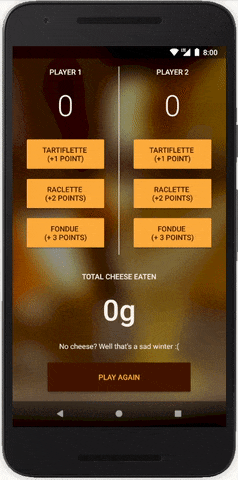

<h1 align="center">Cheesy Winter Contest</h1>

<strong>Winner is the one that ate the most cheese</strong>
 Yes, I'm very French 🇫🇷🧀

 

</img>

<h2>About</h2>
Third of eight student projects made in 2017-2018 as part of <a href="https://eu.udacity.com/course/android-basics-nanodegree-by-google--nd803" target="_blank">Udacity's Android Basics Nanodegree</a>.

<h3>☑️ Phase 1 - (Nov. - Feb.):</h3>

1. <a href="https://github.com/r4dixx/LiterallyHelloWorld">Literally Hello World</a>
2. <a href="https://github.com/r4dixx/HelloAndroid" target="_blank">Hello Android</a>
3. <a href="https://github.com/r4dixx/CheesyWinterContest" target="_blank"><strong>Cheesy Winter Contest</strong></a>
4. <a href="https://github.com/r4dixx/m32O" target="_blank">m32O</a>

<h3>☑️ Phase 2 - (Feb. - Jul.):</h3>

 1. <a href="https://github.com/r4dixx/RookiePlayer">Rookie Player</a>
2. <a href="https://github.com/r4dixx/VisitCalgary">Visit Calgary</a>
3. <a href="https://github.com/r4dixx/TheGuardianView">The Guardian View</a>
4. <a href="https://github.com/r4dixx/Flourish-And-Blotts-Book-Registry">Flourish & Blotts - Book Registry</a>

<h2>Goal and requirements</h2>

Make an app allowing users to track the score of two different teams playing a game of your choice. 

The chosen game has either multiple amounts of points that can be scored or multiple important metrics to track. Code wise, requirements include two columns -  one for each team, multiple buttons, updating views, properly scoping variables, finding views by their ID. A reset button should be included as well.

<h2>Key learnings</h2>

- Java code (that's a first!)
- Nested layouts
- `android:fitsSystemWindows`
- Background image
- strings.xml, dimens.xml and colors.xml
- Orientation lock

Project has been improved at the end of Phase 1 given the new learnings acquired then.

<h2>Installation</h2>

1. Download this project as zip and extract it
2. Import it in Android Studio
3. Sync Gradle and run on your device/emulator

Or use <a href="https://github.com/cesarferreira/dryrun" target="_blank">`dryrun`</a> by <a href="https://github.com/cesarferreira" target="_blank">@CesarFerreira</a>

<h2>Contributing</h2>

This project is open to suggestions and improvements. Simply create a Pull Request and I'll have a look.

<h2>Project status</h2>
Open to translation and code suggestions. Closed feature-wise.

<h2>Credits</h2>

- Author: <a href="https://twitter.com/r4dixx" target="_blank">Amaël Sikel</a>
- Icon created by <a href="https://openclipart.org/detail/293826/swiss-cheese" target="_blank">cactus cowboy</a>
- Background image based off <a href="http://dahu-bodega.com/wp-content/uploads/2016/04/raclette-restaurant-dahu-bodega-specialites-savoyarde-station-cosy-la-norma-menu-maurienne.png" target="_blank">"Le Dahu - La Bodega" menu card</a>
- Thanks to <a href="https://github.com/shoxtrem" target="_blank">@Shoxtrem</a> for the inspiration with <a href="https://github.com/shoxtrem/FoodtasticFondue" target="_blank">FoodtasticFondue</a>

<h2>Copyright</h2>
This project is licensed under the terms of the MIT license and protected by Udacity Honor Code and Community Code of Conduct. See <a href="LICENSE.md">license</a> and <a href="LICENSE.DISCLAIMER.md">disclaimer</a>.
